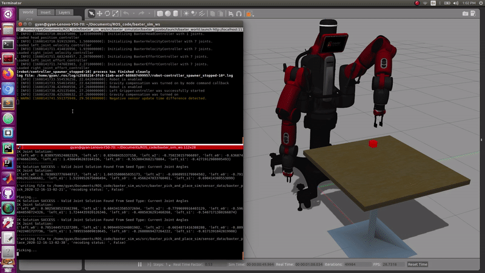

# Baxter - Pick and Place

This package launches gazebo world, Baxter robot, table and a block on the table.
The Baxter robot performs Pick and Place behaviors on the block and records several sensory data (Haptic, IR Range, Solar Distance, Image) for each behavior in a separate file.

## Requirements

1. Ubuntu 16.04
2. ROS Kinetic
3. Gazebo 7.x
4. Baxter Simulator: https://sdk.rethinkrobotics.com/wiki/Simulator_Installation

## How to run?

`roslaunch baxter_gazebo baxter_world.launch`  
`rosrun baxter_pick_and_place_sim pick_and_place.py <num_of_run>`  

Example:  
`rosrun baxter_pick_and_place_sim pick_and_place.py 2`
